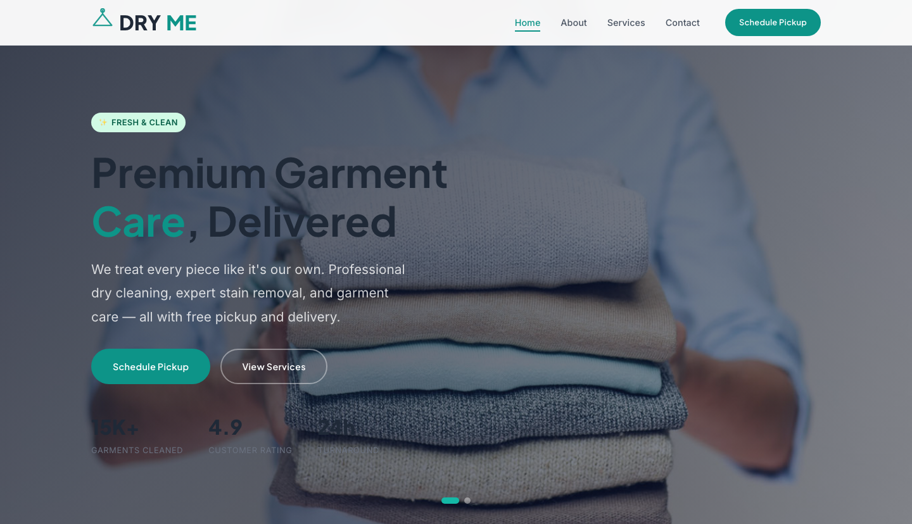

# Dry Cleaning HTML Template — DRYME

A premium, framework-free HTML template for dry cleaning and laundry services. Clean design, smooth animations, and a complete four-page structure built with pure HTML, CSS, and vanilla JavaScript.

## Pages

| Page | File | Description |
|------|------|-------------|
| Home | `index.html` | Hero carousel, service features, how-it-works steps, testimonials, CTA |
| About | `about.html` | Brand story, core values, process walkthrough |
| Services | `services.html` | Full service list with pricing, 3-tier pricing packages |
| Contact | `contact.html` | Pickup scheduling form, contact info card, FAQ accordion |

## Design Distinction (6 Axis)

| Axis | Decision |
|------|----------|
| **Topic Identity** | Dry cleaning / laundry — freshness, convenience, garment care. Every element reinforces the "clean clothes" narrative through garment care imagery and language. |
| **Color System** | Teal `#0D9488` as primary action color paired with charcoal `#1F2937` for text and cream `#FEFCE8` for warm accents. Fresh badge green `#D1FAE5` for trust signals. |
| **Typography** | Plus Jakarta Sans for headings (modern, confident) + Inter for body (highly legible at all sizes). Fluid sizing via `clamp()` across 7 type scales. |
| **Visual Motifs** | Hanger icon SVG logo repeated across header/footer as brand anchor. "Fresh & Clean" badge with sparkle emoji. Clean card borders with teal top-line reveal on hover. |
| **Layout Patterns** | CSS Grid with responsive breakpoints at 980px (2-col) and 720px (1-col + burger). Consistent `clamp()`-based section padding. Feature cards, pricing tiers, and step indicators. |
| **Interaction Design** | IntersectionObserver scroll reveal (0.12 threshold), staggered children animations, hero carousel with auto-advance and dot navigation, burger mobile nav, form validation with `.form-ok`/`.form-err` feedback. |

## Features

- **Pure HTML/CSS/vanilla JS** — zero dependencies, no build step required
- **Custom properties** design system with `--clr-*`, `--ff-*`, `--fs-*`, `--shadow-*`, `--radius-*` tokens
- **Responsive** — fluid typography with `clamp()`, Grid/Flex layouts, breakpoints at 980px and 720px
- **Hero carousel** — dual-slide image carousel with overlay, auto-advance (5s), dot navigation
- **Scroll reveal** — `data-reveal` and `data-reveal-stagger` attributes with IntersectionObserver
- **Burger menu** — animated hamburger icon, full-screen mobile nav, auto-close on link click
- **Active nav** — current page highlighted based on URL pathname
- **Form validation** — `[data-form]` handler with required fields, email regex, `.form-ok`/`.form-err` feedback
- **Footer** — 4-column grid with newsletter signup, social icons, copyright with `data-year`
- **Accessibility** — semantic HTML, ARIA labels, focus states, screen-reader-only utility class
- **Hanger icon motif** — custom SVG logo used consistently across header and footer
- **Fresh & Clean badge** — reusable trust badge component with sparkle prefix

## File Structure

```
dry-cleaning-html-template/
├── assets/
│   ├── css/
│   │   └── base.css          # Complete design system + all component styles
│   ├── img/
│   │   ├── about.jpg          # About page hero image
│   │   ├── blog-1.jpg         # Blog / editorial image
│   │   ├── blog-2.jpg         # Blog / editorial image
│   │   ├── blog-3.jpg         # Blog / editorial image
│   │   ├── carousel-1.jpg     # Hero carousel slide 1
│   │   └── carousel-2.jpg     # Hero carousel slide 2
│   └── js/
│       └── main.js            # All JavaScript (scroll reveal, carousel, burger, form)
├── index.html                 # Home page
├── about.html                 # About page
├── services.html              # Services & pricing page
├── contact.html               # Contact & pickup form page
└── README.md                  # This file
```

## Quick Start

1. Open `index.html` in any modern browser
2. No server required — all files are relative paths
3. Replace images in `assets/img/` with your own content
4. Edit text, pricing, and contact details directly in the HTML files

## 📸 Screenshot



## Design System Tokens

```css
--clr-teal: #0D9488;        /* Primary action color */
--clr-charcoal: #1F2937;    /* Text and headings */
--clr-cream: #FEFCE8;       /* Warm accent backgrounds */
--clr-light: #F8FAFB;       /* Section backgrounds */
--ff-heading: 'Plus Jakarta Sans', sans-serif;
--ff-body: 'Inter', sans-serif;
```

---

**Let's Build Something Together** 🚀

https://tally.so/r/q4q1L9
